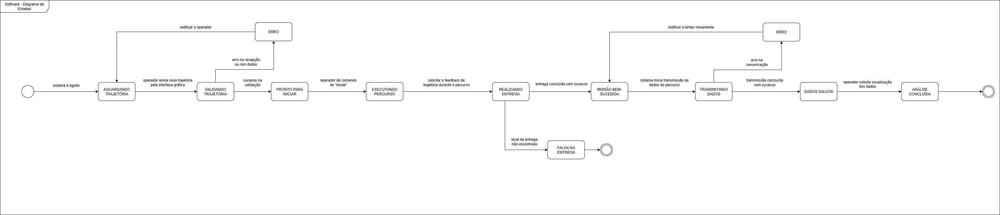

# Descrição de Software

Esta seção detalha a concepção do software para o projeto do carrinho autônomo. A abordagem utilizada foi a Engenharia de Requisitos, definindo os atores do sistema, o cenário de uso, o backlog do produto em formato de Histórias de Usuário com critérios de aceite claros, e os requisitos não-funcionais que guiarão o desenvolvimento e a qualidade do sistema.

## Atores e Cenário de Uso

Para o escopo deste software, identificamos dois atores principais:

* **Professor/Operador:** O usuário humano responsável por interagir com a interface gráfica para programar a trajetória, iniciar a operação do carrinho e analisar os dados de desempenho coletados ao final de uma missão.
* **Banco de Dados (Ator Secundário):** É um ator não-humano que representa o sistema de armazenamento externo. Ele interage com o nosso sistema para persistir os dados gerados durante o percurso e para fornecê-los quando solicitado para análise.

O diagrama de caso de uso abaixo ilustra as interações principais entre os atores e o sistema.

**Cenário de Uso Principal:**

Professor/Operador posiciona manualmente o objeto frágil (similar a um ovo) no compartimento de carga do carrinho. Em seguida, utilizando a interface gráfica do sistema, ele cria uma sequência de comandos que define a trajetória completa.

Após o envio das instruções via comunicação sem fio, o sistema (através do software embarcado no carrinho) executa a rota de forma autônoma. Ao chegar ao destino, o objeto é depositado automaticamente em uma caixa acolchoada.

Durante o percurso, o sistema registra os dados de trajetória e tempo. Ao final da missão, esses dados são transmitidos e armazenados no Banco de Dados, ficando disponíveis para posterior análise pelo Professor/Operador.

## Backlog do Produto (Histórias de Usuário)

O backlog do produto foi construído utilizando o formato de Histórias de Usuário para manter o foco no valor entregue ao usuário final. A priorização foi definida pelo método MoSCoW (Must Have, Should Have, Could Have).

| ID    | Título da História                  | Prioridade (MoSCoW) | História de Usuário (Descrição)                                                                                                                                              |
| :---- | :---------------------------------- | :------------------ | :--------------------------------------------------------------------------------------------------------------------------------------------------------------------------- |
| **-** | **Épico 1: Gerenciamento e Execução de Trajetória** | **-** | **-** |
| HU-01 | Programação de Trajetória           | Must Have           | Como um professor/operador, eu quero criar uma trajetória em uma interface gráfica, definindo uma sequência de comandos, para que eu possa programar o percurso que o carrinho deve seguir. |
| HU-02 | Execução de Trajetória Programada   | Must Have           | Como um professor/operador, eu quero que o carrinho execute fielmente a sequência de comandos enviada, para que ele complete qualquer um dos três tipos de percurso definidos no desafio de forma autônoma. |
| HU-03 | Depósito Automático da Carga        | Must Have           | Como um professor/operador, eu quero que o carrinho deposite a carga automaticamente na caixa acolchoada ao final da trajetória, para que o objetivo da entrega seja cumprido sem intervenção humana. |
| **-** | **Épico 2: Coleta, Análise e Usabilidade** | **-** | **-** |
| HU-04 | Registro de Dados da Missão         | Must Have           | Como um professor/operador, eu quero que o sistema registre a trajetória percorrida e o tempo gasto durante a execução, para que eu possa coletar dados para análise de desempenho. |
| HU-05 | Persistência de Dados da Missão     | Must Have           | Como um professor/operador, eu quero que os dados de trajetória e tempo sejam salvos em um banco de dados, para que os resultados de diferentes execuções possam ser armazenados permanentemente. |
| HU-06 | Visualização de Dados para Análise  | Should Have         | Como um professor/operador, eu quero uma tela no software para visualizar os dados de desempenho das missões, para que eu possa fazer a análise dos resultados.            |
| HU-07 | Aprimoramento da Usabilidade        | Could Have          | Como um professor/operador, eu quero que a interface gráfica seja aprimorada com mais recursos visuais e fluxos simplificados, para que a programação da trajetória seja mais fácil e intuitiva. |

### Critérios de Aceite das Histórias de Usuário

Abaixo estão detalhados os critérios de aceite para cada História de Usuário, definindo as condições que devem ser satisfeitas para que a funcionalidade seja considerada completa.

### HU-01: Programação de Trajetória

* **Dado que** a interface gráfica está aberta, **quando** eu acesso a área de programação, **então** devo ver botões para adicionar comandos de "Andar (cm)" e "Girar (graus)".
* **Dado que** adicionei comandos, **quando** eu os organizo na tela, **então** devo poder ver a sequência completa da trajetória.
* **Dado que** a trajetória está pronta, **quando** eu clico no botão "Enviar ao Carrinho", **então** os dados devem ser transmitidos via tecnologia sem fio.
* **Dado que** os dados foram enviados, **quando** a transmissão é bem-sucedida, **então** devo receber uma mensagem de confirmação na tela (ex: "Trajetória enviada com sucesso!").

### HU-02: Execução de Trajetória Programada

* **Dado que** o carrinho recebeu uma sequência de comandos, **quando** o comando de início é acionado, **então** ele deve executar o primeiro comando da lista.
* **Dado que** um comando foi concluído, **quando** existem mais comandos na lista, **então** o carrinho deve executar o próximo comando sequencialmente.
* **Dado que** o último comando foi executado, **quando** a lista de comandos termina, **então** o carrinho deve parar completamente.

### HU-03: Depósito Automático da Carga

* **Dado que** o carrinho parou após o último comando da trajetória, **quando** ele identifica o fim da missão, **então** o sistema de software deve acionar o comando para o hardware de depósito.
* **Dado que** o mecanismo de depósito foi acionado, **quando** o ciclo de entrega termina, **então** o software deve garantir que o mecanismo retorne à sua posição inicial de repouso.

### HU-04: Registro de Dados da Missão

* **Dado que** a execução da trajetória foi iniciada, **quando** o carrinho está em movimento, **então** o software embarcado deve registrar periodicamente sua posição estimada (telemetria).
* **Dado que** a execução foi iniciada, **quando** a missão termina, **então** o software deve ter calculado e armazenado o tempo total decorrido.

### HU-05: Persistência de Dados da Missão

* **Dado que** uma missão foi concluída, **quando** o carrinho está em estado de repouso, **então** ele deve transmitir o pacote de dados (trajetória e tempo) para o sistema central.
* **Dado que** o sistema central recebeu os dados, **quando** os dados são válidos, **então** eles devem ser inseridos em uma nova entrada no banco de dados, associada a um identificador único de missão.

### HU-06: Visualização de Dados para Análise

* **Dado que** estou na interface gráfica, **quando** eu acesso a seção "Resultados", **então** devo ver uma lista de missões executadas (p.ex., por data e hora).
* **Dado que** selecionei uma missão da lista, **quando** os dados são carregados, **então** devo ver na tela uma representação visual da trajetória percorrida e o tempo total gasto.

### HU-07: Aprimoramento da Usabilidade

* **Dado que** estou programando a trajetória, **quando** eu olho para a interface, **então** os botões e comandos são representados por ícones intuitivos.
* **Dado que** ocorreu um erro (ex: falha de comunicação), **quando** o sistema me notifica, **então** a mensagem de erro deve ser clara e amigável.

## Requisitos Não-Funcionais

Os requisitos não-funcionais definem os atributos de qualidade e as restrições operacionais do sistema.

### Must Have:

* **RNF-01: Segurança da Carga:** O software de controle de motores deve implementar rampas de aceleração e desaceleração suaves para garantir que a carga frágil não sofra impactos durante todo o percurso.
* **RNF-02: Execução em Tempo Real:** O sistema embarcado deve processar os comandos de movimento e controlar os motores em tempo real, sem atrasos perceptíveis que comprometam a precisão da trajetória.
* **RNF-03: Comunicação Sem Fio:** A comunicação entre a interface gráfica e o carrinho deve ser realizada exclusivamente por uma tecnologia sem fio (ex: Wi-Fi ou Bluetooth), garantindo estabilidade na transmissão de dados a uma distância operacional definida.

### Should Have:

* **RNF-04: Confiabilidade da Persistência:** O sistema deve ser capaz de armazenar os dados da missão localmente no carrinho e reenviá-los caso a primeira tentativa de transmissão para o banco de dados falhe.

### Could Have:

* **RNF-05: Design Responsivo:** A interface gráfica poderá ser projetada para se adaptar a diferentes tamanhos de tela, possibilitando o uso em desktops e tablets.

## Diagrama BPMN

## Diagrama de Casos de Uso

## Diagrama Entidade-Relacionamento (DER)

## Diagrama de Estados

## Análise de Dados

Com base nos requisitos definidos e na modelagem do banco de dados, a análise será realizada sobre as variáveis de telemetria coletadas durante a execução das rotas. As variáveis consideradas são:

- **Velocidade média**: avalia o desempenho do veículo em diferentes rotas.  
- **Corrente média**: permite estimar o consumo elétrico do sistema.  
- **Tensão de operação**: monitora as condições de alimentação do veículo.  
- **Energia consumida (J)**: calculada a partir da relação entre tensão, corrente e tempo de uso.  
- **Distância percorrida**: associada diretamente ao desempenho físico do veículo.  
- **Tempo de execução**: obtido a partir do intervalo entre início e fim de cada rota.  
- **Status de execução**: indica se a operação foi concluída corretamente ou se ocorreram falhas.  

A análise numérica será conduzida por meio de tabelas contendo valores coletados, possibilitando o cálculo de médias, máximos, mínimos e comparações entre diferentes execuções.  

Complementarmente, a análise gráfica será realizada por meio de representações visuais, como gráficos de barras, linhas e dispersão, permitindo identificar tendências, padrões e correlações entre variáveis — por exemplo, entre *velocidade média* e *energia consumida*.  

O tempo total de cada execução será calculado a partir dos campos `hora_inicio` e `hora_fim` registrados na entidade **Rota**, conforme a equação: *tempo_rota = hora_fim - hora_inicio*

Esse indicador possibilita avaliar a eficiência global da rota e identificar possíveis gargalos no percurso.  

Adicionalmente, será gerada uma representação gráfica da trajetória percorrida pelo carrinho, construída a partir das instruções armazenadas na entidade **Instrução**. Cada comando de *giro* ajusta a orientação do veículo, enquanto os comandos de *deslocamento* determinam a progressão em coordenadas `(x,y)`. Os pontos sucessivos serão conectados em um gráfico bidimensional, fornecendo uma visualização intuitiva da rota executada.  

Com essa abordagem, o sistema permite não apenas a avaliação quantitativa das variáveis de desempenho, mas também a interpretação visual do comportamento do veículo em diferentes rotas.
